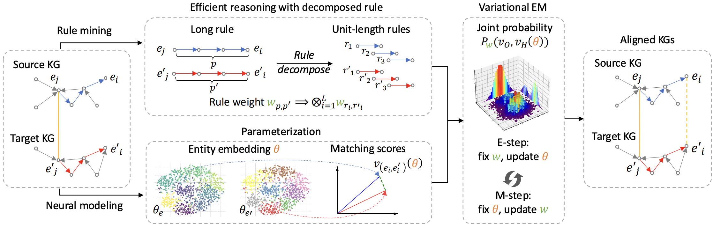
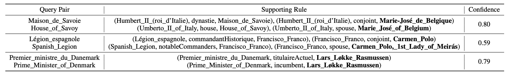

# Entity Alignment via Neuro-symbolic Reasoning

<div align="center">
    <a href="http://makeapullrequest.com"></a>
      <a href="http://makeapullrequest.com"></a>
      <a href="https://arxiv.org/abs/2410.04153"></a>
</div>

NeuSymEA is an entity alignment framework driven by neuro-symbolic reasoning, offering an efficient and interpretable solution for large-scale knowledge fusion. This work has been accepted by [NeurIPS&#39;25](https://arxiv.org/abs/2410.04153).



## 🌟 Key Features

- **❶ Robust entity alignment under low resource setting**: achieving 73.7% hit@1 accuracy on $DBP15K_{FR-EN}$ with only 1% pairs as seed alignments.
- **❷  Explanation over knowledge graphs:** NeuSymEA's rule mining interpretable alignment results, enabling users to trace the reasoning process of alignment.

## 🚀 Quick Start

### 1. Install the required packages

```bash
pip install -r requirements.txt
```

### 2. Run the baseline model (e.g. lightea)

```bash
python run-baseline.py --dataset fr_en --train_ratio 0.01 --ea_model lightea --gpu 1 
```

### 3. Run neuSymEA with the lightea model as base ea model

```bash
python run-neusymea.py --dataset fr_en --train_ratio 0.01 --base_ea_model lightea --gpu 1
```

### 4. Run Paris

```bash
python run-paris.py --dataset fr_en --train_ratio 0.01
```

### 5. Generate interpretations for the inferred pairs using the explainer.

```bash
python explain.py
```

> Instances of the mined supporting rules for the inferred pairs:



# 🍀 Citation

If you find this work helpful, please cite our paper:

```
@inproceedings{chen2025neusymea,
title={NeuSym{EA}: Neuro-symbolic Entity Alignment via Variational Inference},
author={Shengyuan Chen, Zheng Yuan, Qinggang Zhang, Wen Hua, Jiannong Cao, Xiao Huang},
booktitle={The Thirty-ninth Annual Conference on Neural Information Processing Systems},
year={2025},
url={https://openreview.net/forum?id=SAbQLqf8XL}
}
```

## Acknowledgement

The code is based on [PRASE](https://github.com/qizhyuan/PRASE-Python), [Dual-AMN](https://github.com/MaoXinn/Dual-AMN), and [LightEA](https://github.com/MaoXinn/LightEA), the dataset is from [OpenEA benchmark](https://github.com/nju-websoft/OpenEA).

This project is licensed under the GNU General Public License v3.0 ([LICENSE](LICENSE.txt)).
